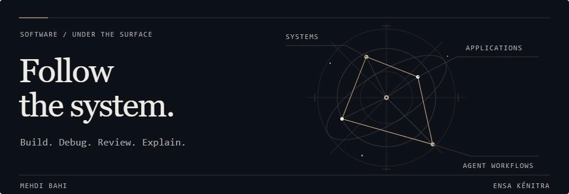

# Hi, I'm Mehdi Bahi

**Software Engineering Student @ ENSA Kénitra**

[Email](mailto:mr.mehdi.bahi@gmail.com) · [LinkedIn](https://www.linkedin.com/in/bahimehdi) · [GitHub](https://github.com/bahimehdi)

I build full-stack applications, work with Unix systems and databases, and explore agentic development. I care about understanding what I build well enough to debug it, review it, and explain it.

## Skills & technologies

### Programming languages

           

### Application development

        

### Databases

     

### Systems & tools

       

### Data & BI

     

**Also worked with:** Unix processes, pipes and signals; TCP/UDP sockets; Cisco routing and switching; REST APIs, OpenAPI, JWT and OAuth2; relational modeling and Entity Framework Core.

## Currently exploring

- Spring Boot, React, and TypeScript.
- Distributed systems with Kafka, PostgreSQL, and Redis.
- Transactions, Saga, and Outbox patterns.
- DevOps, containers, cloud, and observability.

## Agentic development

**Codex · Claude Code · OpenCode**

Repository rules, reusable skills, and agent harnesses. Planning, implementation, review, and verification around real software projects.

## GitHub activity

